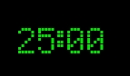

# Minimalistic Pomodoro Timer

A simple, transparent Pomodoro timer with keyboard controls. Features a clean LED-style display and the ability to move the window around the screen.



For the best visual experience, we recommend using the [Serif LED Board-7 font](https://www.1001freefonts.com/de/serif-led-board-7.font).

## Features

- Transparent window with no frame
- LED-style display in green
- Keyboard controls
- Position memory between sessions
- White border when focused

## Requirements

- Python 3.x

## Installation

1. (Optional) Place a custom TTF font file in the project directory
2. Run the installation script:

```
install.bat
```

## Usage

Run the timer:

```
run.vbs
```

This will start the timer without showing any console window.

### Controls

- `s` - Start/Pause timer
- `r` - Reset timer
- `e` - Set a custom time in minutes
- Arrow keys - Move window
- Shift + Arrow keys - Fine movement control

## Configuration

The following settings can be configured in `settings.ini`:

- Window position (automatically saved and restored)
- Font size (default: 96)
- Font path (optional, uses Arial if not specified)

Example settings.ini:

```ini
[Window]
x = 100
y = 100

[Display]
font_size = 96
font_path = serif_led_board-7.ttf  # Optional, remove to use Arial
```

## Files

- `main.py` - Application entry point
- `timer.py` - Timer implementation
- `logger.py` - Logging functionality
- `settings.ini` - Configuration file
- `requirements.txt` - Python dependencies
- `install.bat` - Installation script
- `run.bat` - Execution script
- `pomodoro.log` - Application log file
